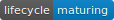

```{r, include = FALSE}
knitr::opts_chunk$set(
  collapse = TRUE,
  comment = "#>"
)
```

## Introduksjon

Kvar funksjon i `rapwhale` har eit «skilt» på hjelpesida
som seier kva utviklingsnivå han er på,
for eksempel om han er ein stabil funksjon som er anbefalt for bruk
eller ein eksperimentell funksjon som ein helst bør halda seg unna.
Her er ei kort skildring av utviklingsnivåa me brukar.
For meir om tankegangen bak utviklingsnivå,
sjå vignettane til
[`lifecycle`-pakken](https://cran.r-project.org/package=lifecycle).

## Utviklingsnivåa

Førebels brukar me tre utviklingsnivå:

- {style="vertical-align:middle"}
- {style="vertical-align:middle"}
- {style="vertical-align:middle"}

Desse svarar til nivåa i
[`lifecycle`-pakken](https://cran.r-project.org/package=lifecycle)-pakken,
men me har eigne definisjonar tilpassa vår bruk og vår målgruppe.

TLDR-versjonen av dette dokumentet er at funksjonar på nivå
{style="vertical-align:middle"}
tilrår me at du brukar,
dei på nivå
{style="vertical-align:middle"}
*kan* du bruka, men på eige ansvar, og du må vera budd på *mindre* endringar
og små feil,
mens dei på nivå
{style="vertical-align:middle"}
bør du unngå, men du kan gje tilbakemeldingar på dei.
Her følgjer ei nærare skildring.


### Stable

Ein funksjon merkt med {style="vertical-align:middle"},
tilrår me for bruk. Følgjande skal vera oppfylt:

- Ønskt funksjonalitet er fastsett, og alle utviklarane har godkjent han
- Funksjonsnamn og argumentstruktur er heilt fastsett
- Implementeringa er komplett
- Det finst automatiske testar (`testthat`-pakken) for all funksjonalitet,
  som sikrar at funksjonen fungerer som han skal
- Dekningsgraden for testane er 100 % (`covr`-pakken)
- Dokumentasjonen på hjelpesida er komplett og har også brukseksempel
- Minst to personar utanom den opphavlege utviklaren
  har kvalitetssikra heile funksjonen

Ein slik funksjon
kan du altså bruka
utan å måtte uroa deg.
Det *kan* sjølvsagt finnast feil her,
men desse lovar me å retta opp viss me får tilsendt
[eit reprex](https://www.tidyverse.org/help/).

Det kan komma utvida funksjonalitet i framtida (med nye funksjonsargument),
men desse skal normalt ikkje påverka eksisterande funksjonalitet.

Ein sjeldan gang *kan* det likevel komma (alle slags) andre endringar,
men då er det i så fall svært gode grunnar til dette,
og me vil varsla om det,
med informasjon om korleis du kan tilpassa koden din til endringane.


### Maturing

Førebels er dei færraste funksjonar stabile.
Men mange er merkte med
{style="vertical-align:middle"}.

Desse er på god veg til å verta stabile,
men det manglar framleis litt.
Følgjande skal vera oppfylt:

- Ønskt *hovud*funksjonalitet er fastsett,
  men er ikkje nødvendigvis enno godkjent av alle utviklarane
- Funksjonsnamn og argumentstruktur er tentativt fastsett,
  men det kan komma (mindre) endringar,
  for eksempel endringar i argumentnamn eller -rekkjefølgje
- Det meste av funksjonen er implementert,
  men det kan vera delar av tiltenkt funksjonalitet som framleis manglar
- Det finst automatiske testar (`testthat`-pakken)
  for iallfall dei viktigaste delane av funksjonen
- Dekningsgraden for testane er altså ikkje nødvendigvis 100 % (`covr`-pakken)
- Hjelpesida har dokumentasjon,
  men denne kan vera ufullstendig og ikkje språkleg finpussa,
  og det kan mangla (gode) brukseksempel
- Funksjonen er ikkje ferdig kvalitetssikra,
  men skal ha gjennomgått noko kvalitetssikring

Dette er ein funksjon du godt kan bruka,
og han skal ha jamn god kvalitet,
men me gjev ingen garantiar.
Spesielt i sjeldne grensetilfelle
(for eksempel viss du gjev han innadata med 0 rader eller med `NA`-verdiar)
kan det vera at han ikkje fungerer heilt som han skal.

Du må vera budd på små endringar (for eksempel i argumentnamn),
men i hovudsak er funksjonalitet og grensesnitt til funksjonen fastsett.
Det gjenstår berre ein del finpussing og kvalitetssikring.
Òg her rettar me sjølvsagt feil me vert gjorde merksame på.


### Experimental

Ein funksjon merkt med
{style="vertical-align:middle"}
tilrår me ikkje for vanleg bruk.
Følgjande skal vera oppfylt:

- Funksjonaliteten er ikkje fastsett –
  det implementerte er berre eit forslag
- Funksjonsnamn og argumentstruktur er ikkje fastsett
- Noko funksjonalitet er implementert
- Det finst ikkje nødvendigivs automatiske testar (`testthat`-pakken)
- Hjelpesida finst, men kan vera svært mangelfull
- Funksjonen er ikkje ferdig kvalitetssikra,
  og er kanskje ikkje kvalitetssikra i det heile teke

Dette er funksjonar som ikkje er heilt gjennomtenkte
og ferdigdiskuterte i fagsentergruppa.
Det kan vera dei i framtida vert endra mykje,
delt opp i fleire separate funksjonar,
slegne saman med andre
eller fjerna heilt.
Men me tek svært gjerne imot tilbakemeldingar på dei.

Merk at du *kan* bruka desse funksjonane
(så lenge dei er eksporterte),
men du må då vera budd på framtidige endringar.


### Andre nivå

Det finst òg andre utviklingsnivå i `lifecycle`-pakken (nokre utdaterte):

- {style="vertical-align:middle"}
- {style="vertical-align:middle"}
- {style="vertical-align:middle"}
- {style="vertical-align:middle"}
- {style="vertical-align:middle"}

Desse brukar me førebels ikkje,
men me kan komma til å gjera det i framtida.


### Manglande nivå

Alle funksjonar i `rapwhale` *skal* ha utviklingsnivå definert.
Men viss det ved ein inkurie manglar,
vert funksjonen rekna som
{style="vertical-align:middle"}.


## Offentlege og interne funksjonar

Både offentlege (eksporterte) *og* interne funksjonar i `rapwhale`
skal ha utviklingsnivå definert.
At ein intern funksjon er
{style="vertical-align:middle"},
gjev nyttig informasjon,
då det medfører at ein trygt kan bruka han i andre
(offentlege eller interne) funksjonar.
Men viss han er
{style="vertical-align:middle"},
må ein vera forsiktig,
og funksjonen ein brukar han i,
kan aldri vera
{style="vertical-align:middle"}
eller
{style="vertical-align:middle"}.

For eksterne brukarar (altså ikkje tilsette på fagsenteret) gjeld regelen
at ein *aldri* skal bruka interne `rapwhale`-funksjonar
(altså ved å kalla dei tre med kolon, `rapwhale:::funksjonsnamn()`).
Viss ein likevel vel å bruka dei
(det er eit fritt land …),
bør ein handtera dei som om dei var
{style="vertical-align:middle"},
uavhengig av faktisk utviklingsnivå.
