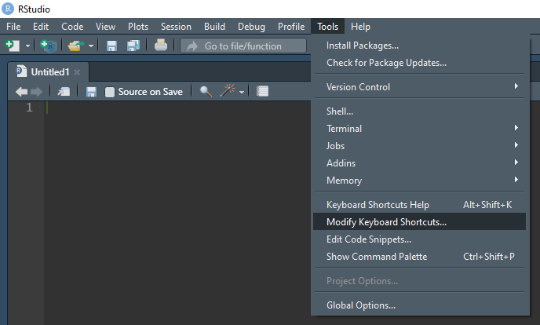

```{r, include = FALSE}
knitr::opts_chunk$set(
  collapse = TRUE,
  comment = "#>"
)
```

## Om dette dokumentet

Dette er dokumentasjon på korleis ein kan bruka pakkane `styler` og `lintr`
for å passa på at koden ein skriv fylgjer felles kodestil.


## styler

[`styler`](https://github.com/r-lib/styler) er ein r-pakke som formaterar kode
etter ein spesifisert kodestil.
Standard er `tidyverse`-stilguiden som kjem med pakken,
men ein kan òg laga eigne stilguidar.
I `rapwhale` har me funksjonen `rapwhale_style()` som kan brukast med
`styler`-pakken for å formatera kode etter vår felles kodestil.

### Installasjon og bruk

Sjølve `styler`-pakken installerast på vanleg måte,
til dømes ved å køyra:

```{r installer-styler, eval=FALSE}
install.packages("styler")
```

#### Manuell bruk

Etter at `styler` er installert kan ein manuelt bruka den til å formatera
pakkar, filer eller markert område etter spesifisert kodestil.
For å byta til å bruka vår kodestil kan ein anten velja «Set style»
under «Styler» frå nedtrekksmenyen «Addins» på verktøylinja i RStudio,
eller køyra `styler:::set_style_transformers()` direkte i konsollen.
I boksen som kjem opp skriv ein inn `rapwhale::rapwhale_style()`
og trykkjer ok.
`styler`vil no bruka vår kodestil ved formatering av kode.

For å få `rapwhale::rapwhale_style()` som standard kodestil,
slik at ein ikkje treng endra for kvar økt,
må ein setja dette i `.Rprofile`-fila.
For å gjera dette kan ein køyra `usethis::edit_r_profile()`
og leggja til linja
`options(styler.addins_style_transformer = "rapwhale::rapwhale_style()")`
i fila som vert opna.

I same nedtekksmeny som ein finn «Set style» finst òg vala «Style selection»,
«Style active file» og «Style active package».
Desse er ganske sjølvforklarande,
og kan altså brukast for å formatera markert tekst,
aktiv fil, eller aktiv pakke til den valde kodestilen.


For enkel og rask tilgang til desse funksjonane kan ein setja snarvegar
til dei.
Dette gjer ein ved å gå på «Tools» på verktøylinja og så
«Modify keyboard shortcuts».



Ein kan til dømes byta den gamle snarvegen «Ctrl+Shift+A» frå å vera
«Reformat Selection» (RStudio) til å bli «Style selection» (styler),
og «Alt+Shift+A», som er ledig, til å bli «Style active file».


Når ein så køyrer `styler` på ei fil eller eit markert område vil koden
verta endra direkte i fila,
og ein kan sjå på endringane til dømes ved hjelp av ei diff-vising i Git.

## lintr

[`lintr`](https://github.com/r-lib/lintr) er ein r-pakke som kan sjekka kode
for syntaksfeil, semantiske feil og at den fylgjer ein gjeven kodestil.

### Installasjon og bruk

Sjølve `lintr`-pakken installerast på vanleg måte,
til dømes ved å køyra:

```{r installer-lintr, eval=FALSE}
install.packages("lintr")
```

Øvst i `kvalreg` ligg ei fil med namnet `.lintr`.
Dette er ei konfigurasjonsfil som seier kva for «linters» som skal brukast
i prosjektet.

#### Manuell bruk

Når `lintr` er installert kan ein køyra det på koden,
med liknande framgangsmåte som forklart for `styler` ovanfor.
I nedtrekksmenyen «Addins» på verktøylinja i RStudio finn ein to val under
`lintr`, «Lint current file» og «Lint current package».


På same måte som for `styler` kan ein godt setja opp ein snarveg for
«Lint current file», som er den mest aktuelle.
Eit forslag er «Alt+Shift+L», enkelt å hugsa med L for lint.
Dersom ein brukar denne snarvegen frå før («Unfold Selected»)
kan ein sjølvsagt velja ein annan.


Når ein så køyrer funksjonen på ei fil får ein opp resultatet i eit nytt panel
kalla «Markers», der konsollen pleier å vera,
viss fila hadde nokre feil/problem.
Til skilnad frå `styler` gjer ikkje `lintr` nokre endringar i sjølve fila,
men gjev ut feilmeldingar/åtvaringar i det nye panelet.
Det er éi linje for kvar gong ein linter gjorde utslag,
der det står kva kodelinje det gjeld og ein melding om kva som er feil.
Ein kan dobbelklikka på meldingane i dette panelet for å koma direkte til
motsvarande linje i koden.
Under er eit enkelt eksempel der `lintr` er køyrd på ei fil med nokre feil.


